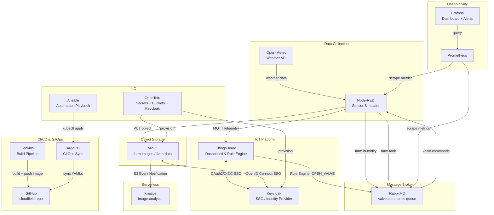

# CloudField IoT Platform 🌾

**Cloud-Native Smart Agriculture Platform** – Soil moisture monitoring and automated irrigation for crops.

---

## 🏗️ Architecture



---

## 🌐 Service URLs

| Service | URL | Credentials |
|---------|-----|-------------|
| Node-RED | http://nodered.172.31.76.79.nip.io | - |
| ThingsBoard | http://thingsboard.172.31.76.79.nip.io | tenant@thingsboard.org / tenant |
| RabbitMQ | http://rabbitmq.172.31.76.79.nip.io | admin / admin123 |
| MinIO | http://minio.172.31.76.79.nip.io | admin / admin123 |
| Keycloak | http://keycloak.172.31.76.79.nip.io | admin123 / admin123 |
| Grafana | http://grafana.172.31.76.79.nip.io | admin / prom-operator |
| ArgoCD | http://argocd.172.31.76.79.nip.io | admin / (kubectl get secret) |
| Jenkins | http://jenkins.172.31.76.79.nip.io | admin / (kubectl get secret) |
| Image Analyzer | http://image-analyzer.default.172.31.76.79.nip.io | - |

---

## 📦 Services & Technologies

| Service | Technology | Namespace | Purpose |
|---------|-----------|-----------|---------|
| Node-RED | Kubernetes Deployment | default | Sensor simulation, MQTT, AMQP flows |
| ThingsBoard | Kubernetes Deployment | default | IoT Dashboard, Rule Engine, Alarms |
| RabbitMQ | Kubernetes Deployment | default | Message broker for valve commands |
| MinIO | Kubernetes Deployment | default | Object storage for camera images |
| Keycloak | Kubernetes Deployment | default | SSO for ThingsBoard + MinIO |
| Image Analyzer | Knative Service | default | Serverless image metadata extraction |
| Jenkins | Kubernetes Deployment | default | CI/CD pipeline |
| ArgoCD | Kubernetes Deployment | argocd | GitOps continuous deployment |
| Prometheus | Helm (kube-prom-stack) | observability | Metrics collection |
| Grafana | Helm (kube-prom-stack) | observability | Dashboards + Alerts |

---

## 🔄 End-to-End Flow

```
1. Node-RED (every 30s):
   - Generates random soil moisture value (20-80%)
   - Fetches weather from Open-Meteo API
   - Sends telemetry via MQTT to ThingsBoard
   - Sends farm.humidity + farm.tank to RabbitMQ

2. ThingsBoard Rule Engine:
   - IF moisture < 30% AND no rain forecast -> OPEN_VALVE_1
   - Sends RPC command to Node-RED
   - Creates Alarm

3. Node-RED (Valve Controller):
   - Receives RPC from ThingsBoard
   - Function 4 (Idempotency Check): prevents duplicate commands
   - Sends command to RabbitMQ (valve.commands queue)

4. MinIO:
   - Node-RED uploads mock images every 60s
   - S3 Event Notification -> Knative image-analyzer
   - Lifecycle Policy: automatic deletion after 90 days

5. Keycloak SSO:
   - Single Sign-On for ThingsBoard + MinIO
   - Realm: cloudfield
   - Clients: thingsboard-client, minio-client

6. Monitoring:
   - Prometheus scrapes RabbitMQ metrics
   - Grafana Dashboard: Queue Depth, Connections, CPU/Memory
   - Alert: queue_messages > 10 -> Critical
```

---

## 🚀 Installation

### Prerequisites
- MicroK8s with addons: `dns`, `ingress`, `storage`, `observability`, `knative`
- kubectl configured
- Docker Hub account

### 1. Clone repo
```bash
git clone https://github.com/tsilian9/cloudfield.git
cd cloudfield
```

### 2. Deploy with Ansible
```bash
cd ansible
ansible-playbook playbook.yml
```

### 3. Deploy with kubectl (manual)
```bash
kubectl apply -f rabbitmq.yaml
kubectl apply -f minio.yaml
kubectl apply -f nodered.yaml
kubectl apply -f thingsboard.yaml
kubectl apply -f keycloak.yaml
kubectl apply -f jenkins.yaml
kubectl apply -f argocd.yaml
kubectl apply -f monitoring.yaml
kubectl apply -f knative-service.yaml
kubectl apply -f nodered-flow.yaml
kubectl apply -f grafana-alert.yaml
```

### 4. OpenTofu (IaC)
```bash
cd opentofu
tofu init
tofu apply
```

### 5. Verify
```bash
kubectl get pods
kubectl get ingress
```

---

## 📊 SLA Classes

| Class | Latency (p95) | Availability | Services |
|-------|--------------|--------------|---------|
| 🥇 **Gold** | < 100ms | 99.9% | RabbitMQ (99ms), MinIO (98ms), Node-RED (92ms) |
| 🥈 **Silver** | < 5s | 99.5% | Knative warm start (2.8s), ThingsBoard, Keycloak |
| 🥉 **Bronze** | < 30s | 99.0% | Knative cold start (6.7s), Jenkins builds |

See full report: [sla-report.md](sla-report.md)

---

## 🔒 Idempotency Pattern (Phase H)

**Function 4** in the Node-RED Valve Controller implements idempotency:
- **5-second window**: If the same command is sent twice within 5s -> SKIP
- **Flow context**: Stores `lastValveCommand` + `lastValveCommandTime`
- **Result**: Prevents duplicate commands in the `valve.commands` queue

---

## 📁 Project Structure

```
cloudfield/
├── rabbitmq.yaml          # RabbitMQ Deployment + Service + Ingress
├── minio.yaml             # MinIO Deployment + Service + Ingress
├── nodered.yaml           # Node-RED Deployment + Service + Ingress
├── thingsboard.yaml       # ThingsBoard Deployment + Service + Ingress
├── keycloak.yaml          # Keycloak Deployment + Service + Ingress
├── jenkins.yaml           # Jenkins Deployment + Service + Ingress
├── argocd.yaml            # ArgoCD Application
├── monitoring.yaml        # ServiceMonitor for RabbitMQ
├── knative-service.yaml   # Knative Service (image-analyzer)
├── nodered-flow.yaml      # Node-RED flows ConfigMap
├── nodered-configmap.yaml # Node-RED settings ConfigMap
├── grafana-dashboard.json # Grafana Dashboard JSON
├── grafana-alert.yaml     # PrometheusRule (alerts)
├── flows.json             # Node-RED flows (local dev)
├── Dockerfile             # Custom Node-RED image
├── Dockerfile.jenkins     # Custom Jenkins image
├── Jenkinsfile            # Jenkins Pipeline
├── docker-compose.yml     # Local development
├── sla-measure.sh         # SLA measurement script
├── sla-report.md          # SLA report with real measurements
├── sla-results.txt        # Raw measurement results
├── ansible/
│   ├── inventory.ini      # Ansible inventory
│   └── playbook.yml       # Ansible playbook
├── opentofu/
│   ├── main.tf            # OpenTofu resources
│   ├── variables.tf       # Variables
│   ├── outputs.tf         # Outputs
│   └── providers.tf       # Providers (K8s, MinIO, Keycloak)
└── knative/
    └── image-analyzer/
        ├── app.py         # Flask image analyzer
        ├── Dockerfile     # Container image
        └── requirements.txt
```

---

## 🔑 Keycloak SSO Integration

### Realm: `cloudfield`
- **ThingsBoard Client**: OAuth2/OIDC integration
  - Client ID: `thingsboard-client`
  - Redirect URI: `http://thingsboard.172.31.76.79.nip.io/*`
- **MinIO Client**: OpenID Connect integration
  - Client ID: `minio-client`
  - Redirect URI: `http://minio.172.31.76.79.nip.io/*`

### Users
| Username | Role | Access |
|----------|------|--------|
| admin | TENANT_ADMIN | ThingsBoard + MinIO |
| farm-operator | CUSTOMER_USER | ThingsBoard dashboard only |

---

## 📈 Grafana Monitoring

**Dashboard**: CloudField IoT Dashboard  
**URL**: http://grafana.172.31.76.79.nip.io/d/cloudfield-iot-v1

### Panels:
- 🐰 **RabbitMQ Connections** (current: 4)
- 📊 **Queue Depth** – valve.commands
- 📈 **Message Rate** – publish/deliver
- 💻 **CPU Usage** – all CloudField pods
- 🧠 **Memory Usage** – all CloudField pods

### Alerts (PrometheusRule):
| Alert | Condition | Severity |
|-------|-----------|----------|
| RabbitMQQueueDepthHigh | messages > 10 for 1m | 🔴 Critical |
| RabbitMQQueueDepthWarning | messages > 5 for 2m | 🟡 Warning |
| RabbitMQDown | up == 0 for 1m | 🔴 Critical |
| TelemetryRateZero | publish_rate == 0 for 5m | 🟡 Warning |

---

## 🛠️ CI/CD Pipeline (Jenkins + ArgoCD)

```
Developer -> git push -> GitHub
                           |
                       Jenkins (Webhook)
                           |
                     Build Docker Image
                           |
                     Push to Docker Hub
                           |
                       ArgoCD (GitOps)
                           |
                     kubectl apply -> MicroK8s
```

---

*CloudField IoT Platform v1.0 | 2026-08-01*  
*Environment: MicroK8s on Ubuntu VM (172.31.76.79)*
